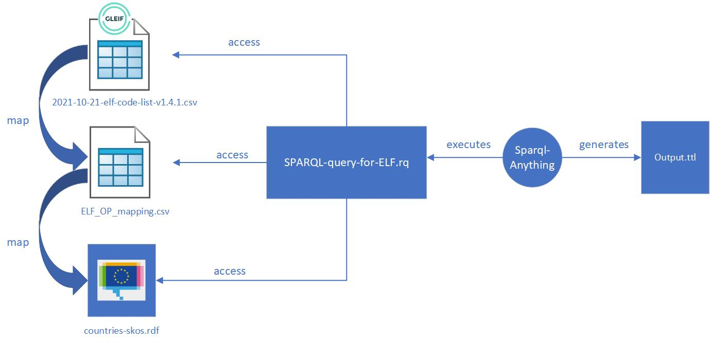

# Entity Legal Forms Code List

## Content
This folder includes the material used to generate the Entity Legal Forms in RDF to be published by the Publications Office for the [legal form of a Legal Entity](https://semiceu.github.io/Core-Business-Vocabulary/releases/2.1.0/#LegalEntity%3AlegalFormType)  .

The folder mainly includes:
1. The file [2023-09-28-elf-code-list-v1.5.csv](2023-09-28-elf-code-list-v1.5.csv) downloaded from [GLEIF Entity Legal Forms](https://www.gleif.org/en/about-lei/code-lists/iso-20275-entity-legal-forms-code-list)
2. The file [countries-skos.rdf](countries-skos.rdf) downloaded from [Publications Office Country Authority Table](https://op.europa.eu/en/web/eu-vocabularies/dataset/-/resource?uri=http://publications.europa.eu/resource/dataset/country)
3. The file [ELF_OP_matching.csv](ELF_OP_matching.csv) that matches the countries in GLEIF with those in Publications Office
4. The file [SPARQL-query-for-ELF-v1.5.rq](SPARQL-query-for-ELF-v1.5.rq) created to generate the Entity Legal Forms in RDF
5. The file [output-v1.5.ttl](output-v1.5.ttl) generated as output containing the Entity Legal Forms in RDF

## Process
### Analysis of the GLEIF Entity Legal Forms

#### Format
The GLEIF Entity Legal Forms are provided in 3 file formats: PDF, Excel and CSV.

In order to perform a transformation, a structured format is preferred, therefore the choice is between Excel and CSV.

The Excel file:
* has 1 sheet only
* does not contain excel/macros formulas
* has the same content as the CSV file

Therefore the CSV is the preferred format for the transformation.

#### Content
The CSV file contains a list of legal forms:
* that are not logical linked (no order/ranking)
* that are not physically linked (no reference between each other)
* that are grouped by the "ELF Code" column because of multiple translations, see for example the ELF Code for Belgium [1TX8](https://github.com/SEMICeu/Taxonomy/blob/master/Entity_Legal_Form/2023-09-28-elf-code-list-v1.5.csv#L115-L117) in Dutch, French and German

In addition, the legal forms:
* depend on a country (Column "Country of formation") which name might be different from the countries in the Publication Office
* have a status (Column "ELF Status ACTV/INAC") active or inactive
* might have, for each single language:
  *  a transliteration in Latin, see for example the ELF Code for Greece [R3HO](https://github.com/SEMICeu/Taxonomy/blob/master/Entity_Legal_Form/2023-09-28-elf-code-list-v1.5.csv#L1413) 
  *  multiple abbrevations, see for example the ELF Code for Belgium [Y1Q4](https://github.com/SEMICeu/Taxonomy/blob/master/Entity_Legal_Form/2023-09-28-elf-code-list-v1.5.csv#L250), where they are concatenated via the ";" delimiter such as "PRIV ST.;PS"

### Transformation

The transformation has been performed via the tool [SPARQL-Anything](https://github.com/SPARQL-Anything/sparql.anything), which:
* does not need to change the structure of the GLEIF CSV file, provided as input for the transformation
* allows to perform just a SPARQL CONSTRUCT query, see [line 10](https://github.com/SEMICeu/Taxonomy/blob/master/Entity_Legal_Form/SPARQL-query-for-ELF-v1.5.rq#L10), and can leverage SPARQL functions such as STRLANG to combine a string with a language tag, see [line 54](https://github.com/SEMICeu/Taxonomy/blob/master/Entity_Legal_Form/SPARQL-query-for-ELF-v1.5.rq#L54)
* allows to query multiple files in different format via the SERVICE directive:
  * the GLEIF ELF Code list in CSV format, see [line 34](https://github.com/SEMICeu/Taxonomy/blob/master/Entity_Legal_Form/SPARQL-query-for-ELF-v1.5.rq#L34)
  * the ELF OP matching in CSV format, see [line 66](https://github.com/SEMICeu/Taxonomy/blob/master/Entity_Legal_Form/SPARQL-query-for-ELF-v1.5.rq#L66)
  * the Publications Office Country Authority Table in RDF format, see [line 71](https://github.com/SEMICeu/Taxonomy/blob/master/Entity_Legal_Form/SPARQL-query-for-ELF-v1.5.rq#L71) 
* can leverage the [string split function](https://jena.apache.org/documentation/query/library-propfunc.html) from the underlying Jena Fuseki, to split a string using a delimiter, see [line 84]( https://github.com/SEMICeu/Taxonomy/blob/master/Entity_Legal_Form/SPARQL-query-for-ELF-v1.5.rq#L84)

The SPARQL query:
* filters only the legal forms in ACTIVE status, see [line 47](https://github.com/SEMICeu/Taxonomy/blob/master/Entity_Legal_Form/SPARQL-query-for-ELF-v1.5.rq#L47)
* adds the transliteration to Latin only for certain languages like Bulgarian (bg) or Greek (el), see [line 57](https://github.com/SEMICeu/Taxonomy/blob/master/Entity_Legal_Form/SPARQL-query-for-ELF-v1.5.rq#L57)
* make sure to have the same countries present in the Publications Office Country Authority Table by using the matching retrieved in [lines 66-69](https://github.com/SEMICeu/Taxonomy/blob/master/Entity_Legal_Form/SPARQL-query-for-ELF-v1.5.rq#L66-L69) with the filter in [lines 96-97](https://github.com/SEMICeu/Taxonomy/blob/master/Entity_Legal_Form/SPARQL-query-for-ELF-v1.5.rq#L96-L97)

The [server version of SPARQL-Anything](https://github.com/SPARQL-Anything/sparql.anything#using-the-server) has been downloaded directly in this folder so it can access to the GLEIF ELF Code list and to the Publications Office Country Authority Table and, via a web interface (pointing the browser to http://localhost:3000/sparql), it helps to type in the SPARQL query and to execute it. 

Due to it's size (200 MB), SPARQL-Anything was not included in this repository, so, in order to run the query, one must download the server version of SPARQL-Anything themselves.

### Validation

The output of the transformation is a RDF file [output-v1.5.ttl](output-v1.5.ttl) containing skos:ConceptScheme pointing to all skos:Concept generated.

The RDF file is validated manually against:

* [https://skos-play.sparna.fr/skos-testing-tool/](https://skos-play.sparna.fr/skos-testing-tool/)
* the shapes downloaded from [https://github.com/skohub-io/shapes](https://github.com/skohub-io/shapes) and used [jena shacl](https://jena.apache.org/documentation/shacl/index.html) to validate
