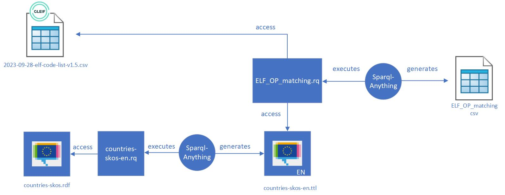

# Entity Legal Forms Code List

## Content
This folder includes the material used to generate the Entity Legal Forms in RDF to be published by the Publications Office for the [legal form type of a Legal Entity](https://semiceu.github.io/Core-Business-Vocabulary/releases/2.1.0/#LegalEntity%3AlegalFormType) in the [Core Business vocabulary](https://semiceu.github.io/Core-Business-Vocabulary/releases/2.1.0/).

## Process

The process is semi-automatic and it is divided in 4 steps:
1. Analysis of the GLEIF Entity Legal Forms
2. Finding and evaluate matches between GLEIF and Publications Office countries
3. Transformation
4. Validation

   

The folder mainly includes:
1. The file [2023-09-28-elf-code-list-v1.5.csv](2023-09-28-elf-code-list-v1.5.csv) downloaded from [GLEIF Entity Legal Forms](https://www.gleif.org/en/about-lei/code-lists/iso-20275-entity-legal-forms-code-list)
2. The file [countries-skos.rdf](countries-skos.rdf) downloaded from [Publications Office Country Authority Table](https://op.europa.eu/en/web/eu-vocabularies/dataset/-/resource?uri=http://publications.europa.eu/resource/dataset/country) version 20230915-0
3. The file [countries-skos-en.rq](countries-skos-en.rq) to select only the English preferred and alternative labels of the [countries-skos.rdf](countries-skos.rdf)
4. The file [ELF_OP_matching.rq](ELF_OP_matching.rq) to find the matches between GLEIF and OP countries 
5. The file [ELF_OP_matching.csv](ELF_OP_matching.csv) that contains the results of the matches
6. The file [SPARQL-query-for-ELF-v1.5.rq](SPARQL-query-for-ELF-v1.5.rq) to generate the Entity Legal Forms in RDF
7. The file [output-v1.5.ttl](output-v1.5.ttl) generated as output containing the Entity Legal Forms in RDF
8. The file [output-v1.5_validated.ttl](output-v1.5_validated.ttl) validated for publication

### Tools
The [SPARQL-Anything server](https://github.com/SPARQL-Anything/sparql.anything#using-the-server) [version 0.9.DEV-5](https://github.com/SPARQL-Anything/sparql.anything/releases/tag/v0.9-DEV.5) has been used to find correspondences and to perform the transformation.
SPARQL-Anything has been downloaded directly in this folder so it can access to the GLEIF ELF Code list and to the Publications Office Country Authority Table and, via a web interface (pointing the browser to http://localhost:3000/sparql), it helps to type in the SPARQL query and to execute it. 

Due to it's size (200 MB), SPARQL-Anything was not included in this repository, so, in order to run the query, one must download the server version of SPARQL-Anything themselves.

For the validation step, the [skos-testing-tool](https://skos-play.sparna.fr/skos-testing-tool/) and  [jena shacl](https://jena.apache.org/documentation/shacl/index.html) tools have been used.

### Analysis of the GLEIF Entity Legal Forms

#### Format
The GLEIF Entity Legal Forms are provided in 3 file formats: PDF, Excel and CSV.

In order to perform a transformation, a structured format is preferred, therefore the choice is between Excel and CSV.

The Excel file:
* has 1 sheet only
* does not contain excel/macros formulas
* has the same content as the CSV file

Therefore the CSV is the preferred format for the transformation.

#### Content
The CSV file contains a list of legal forms:
* that are not logical linked (no order/ranking)
* that are not physically linked (no reference between each other)
* that are grouped by the "ELF Code" column because of multiple translations, see for example the ELF Code for Belgium [1TX8](https://github.com/SEMICeu/Taxonomy/blob/master/Entity_Legal_Form/2023-09-28-elf-code-list-v1.5.csv#L115-L117) in Dutch, French and German

In addition, the legal forms:
* depend on a country (Column "Country of formation") which name might be different from the countries published by the Publications Office, for example GLEIF uses "Brunei Darussalam" while Publications Office uses "Brunei" that is why the matching file [ELF_OP_matching.csv](ELF_OP_matching.csv) is needed
* have a status (Column "ELF Status ACTV/INAC") active or inactive
* might have, for each single language:
  *  a transliteration in Latin, see for example the ELF Code for Greece [3RHO](https://github.com/SEMICeu/Taxonomy/blob/master/Entity_Legal_Form/2023-09-28-elf-code-list-v1.5.csv#L1413) 
  *  multiple abbrevations, see for example the ELF Code for Belgium [Y1Q4](https://github.com/SEMICeu/Taxonomy/blob/master/Entity_Legal_Form/2023-09-28-elf-code-list-v1.5.csv#L250), where they are concatenated via the ";" delimiter such as "PRIV ST.;PS"
 
### Finding and evaluate matches between GLEIF and Publications Office countries

The GLEIF countries are in English language while the OP countries are in multiple languages, therefore the English labels have been selected for matching.

Sparql-Anything executes the query [countries-skos-en.rq](countries-skos-en.rq) to select the countries with only the English preferred and alternative labels, generating the [countries-skos-en.tt](countries-skos-en.ttl); this allows to reduce drastically the time for finding matches. 

A preliminary analysis of the GLEIF and Publication Office has shown that the list of countries have differences.

Sparql-Anything executes the [ELF_OP_matching.rq](ELF_OP_matching.rq) which, in turn, uses the string distance function [CosineDistance](https://github.com/SPARQL-Anything/sparql.anything/blob/v0.9-DEV/FUNCTIONS_AND_MAGIC_PROPERTIES.md#fxcosinedistance) to find the closest matches.
CosineDistance (and JaroWinkler) [resulted better](doc/string_distance_comparison.csv) than other string distances available in Sparql-Anything, generating only 2 false positives out of 117 results looking at the preferred labels.

To improve the results, the CosineDistance has been run also on the alternative labels and the minimum distance among the preferred and alternative labels has been selected. In this way also 2 false positive has been found correctly.

In the example below, the republic of Congo would have been the minimum distance (0,571) if looking only at the preferred label; therefore South Korea would not have been matched (0,757).
However, taking in account the alternative labels, the distance with Republic of Korea is lesser (0,248), thus allowing to select the right match.

The output file of the matching is the file [ELF_OP_matching.csv](ELF_OP_matching.csv) to be used in the transformation step, containing the name of the matched country, the distance and the URI of the matched country. The latter is included so then the OP countries list is not needed anymore for the transformation step.

### Transformation

SPARQL-Anything has been used to perform the transformation which:
* does not need to change the structure of the GLEIF CSV file, provided as input for the transformation
* allows to perform just a SPARQL CONSTRUCT query, see [line 15](https://github.com/SEMICeu/Taxonomy/blob/master/Entity_Legal_Form/SPARQL-query-for-ELF-v1.5.rq#L15), and can leverage SPARQL functions such as [STRLANG](https://www.w3.org/TR/sparql11-query/#func-strlang) to combine a string with a language tag, see [line 65](https://github.com/SEMICeu/Taxonomy/blob/master/Entity_Legal_Form/SPARQL-query-for-ELF-v1.5.rq#L65)
* allows to query multiple files in different format via the SERVICE directive:
  * the GLEIF ELF Code list in CSV format, see [line 46](https://github.com/SEMICeu/Taxonomy/blob/master/Entity_Legal_Form/SPARQL-query-for-ELF-v1.5.rq#L46)
  * the ELF OP matching in CSV format, see [line 87](https://github.com/SEMICeu/Taxonomy/blob/master/Entity_Legal_Form/SPARQL-query-for-ELF-v1.5.rq#L87)
* can leverage the [string split function](https://jena.apache.org/documentation/query/library-propfunc.html) from the underlying Jena Fuseki, to split a string using a delimiter, see [line 94]( https://github.com/SEMICeu/Taxonomy/blob/master/Entity_Legal_Form/SPARQL-query-for-ELF-v1.5.rq#L94)

The transformation execution at the core of the process:

The SPARQL query:
* adds the transliteration to Latin only for certain languages like Bulgarian (bg) or Greek (el), see [line 68](https://github.com/SEMICeu/Taxonomy/blob/master/Entity_Legal_Form/SPARQL-query-for-ELF-v1.5.rq#L68)
* make sure to have the same countries present in the Publications Office Country Authority Table by using the matching retrieved in [lines 82-84](https://github.com/SEMICeu/Taxonomy/blob/master/Entity_Legal_Form/SPARQL-query-for-ELF-v1.5.rq#L82-L84) with the filter in [lines 118-119](https://github.com/SEMICeu/Taxonomy/blob/master/Entity_Legal_Form/SPARQL-query-for-ELF-v1.5.rq#L118-L119)

The output of the transformation is a RDF file [output-v1.5.ttl](output-v1.5.ttl) containing skos:ConceptScheme pointing to all skos:Concept generated.

### Validation
  
The [output-v1.5.ttl](output-v1.5.ttl) file is then validated manually against:

* [https://skos-play.sparna.fr/skos-testing-tool/](https://skos-play.sparna.fr/skos-testing-tool/)
* the shapes downloaded from [https://github.com/skohub-io/shapes](https://github.com/skohub-io/shapes) and used [jena shacl](https://jena.apache.org/documentation/shacl/index.html) to validate

The validation against the skos testing tool find out errors concerning the content:
* ilc - Incomplete Language Coverage	Finds concepts lacking description in languages that are present for other concepts.	FAIL (2645): the concepts are described in the languages of their respective countries
* ipl - Inconsistent Preferred Labels	Finds resources with more then one prefLabel per language.	FAIL (1): The code [X0SD](2023-09-28-elf-code-list-v1.5.csv#L338-L339) is therefore not valid, currently resolved manually by changing the preferred label in alternative label
* ncl - No Common Languages	Checks for common languages in all concept literals.	FAIL: the concepts are described in the languages of their respective countries
* oc - Orphan Concepts	Finds all orphan concepts, i.e. those not having semantic relationships to other concepts.	WARNING (2645): relationships are not created in the CSV and the creation of such relations would need legal analysis
* ol - Overlapping Labels	Finds concepts with similar (identical) labels.	FAIL (234): it happens that certain countries uses same labels such as the codes 5WU6 (Netherlands) and 7SJP (Belgium) that use the same label "Europees economisch samenwerkingsverband", it doesn't necessarily mean that the concepts are the same.

The validation against the shacl shapes highlights only the problem of overlapping labels.

The [output-v1.5.ttl](output-v1.5.ttl) has been reviewed and the [output-v1.5_validated.ttl](output-v1.5_validated.ttl) has been created by replacing manually the preferred labels in alternative label for the X0SD code.
